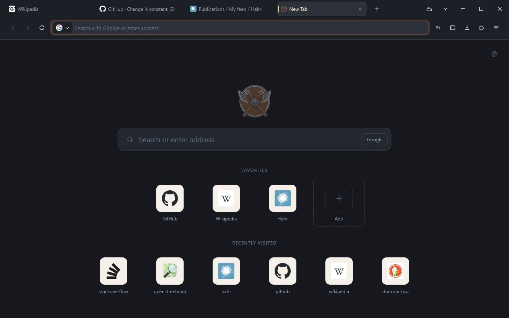
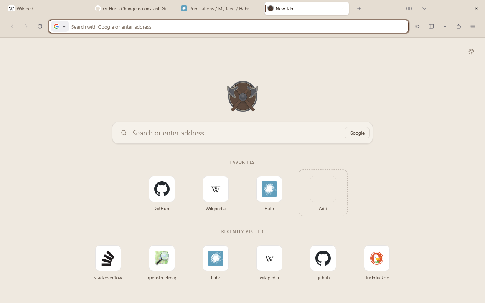
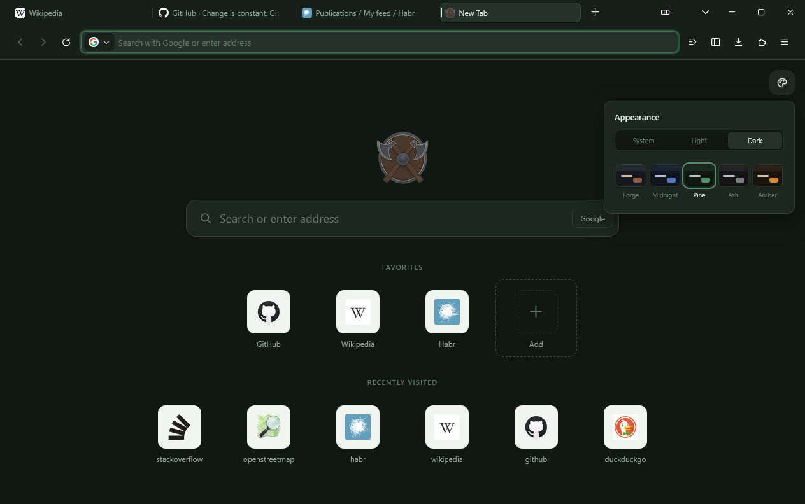
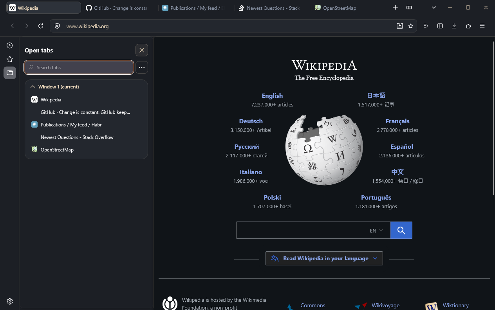
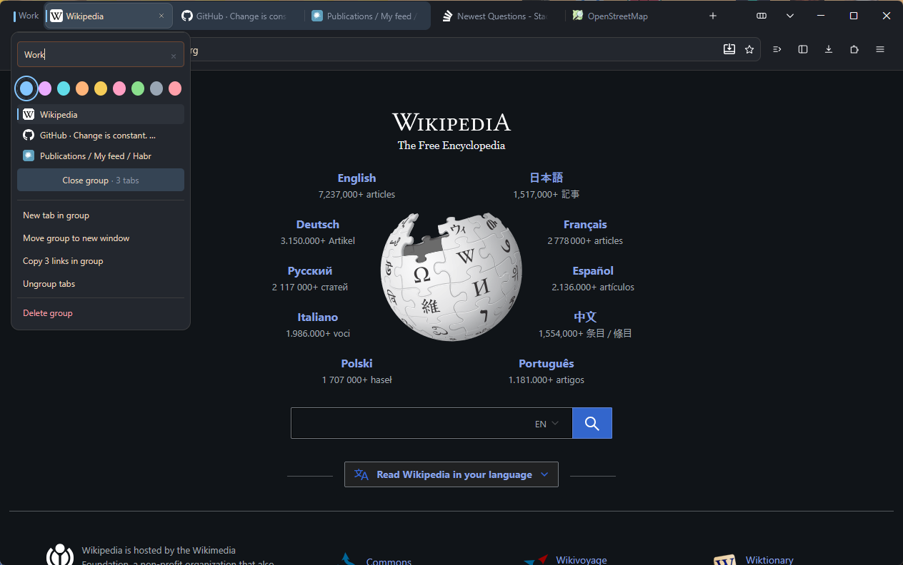

<div align="center">


# Vantara

**A Gecko-based browser that protects your data and doesn't pretend.**

[Русский](README.md) · **English**

[](https://github.com/L0lopop/Vantara/stargazers)
[](https://github.com/L0lopop/Vantara/network/members)
[](LICENSE)
[](docs/ARCHITECTURE.md)
[](docs/ROADMAP.md)

</div>

<p align="center">
  
</p>

---

## What it is

Vantara is a Firefox fork with a completely rewritten interface and a
different take on privacy. Not a theme on top of Firefox and not a build
with a tweaked `about:config`, but a browser of its own: its own interface,
its own features, its own defaults.

**Three principles we don't compromise on:**

1. **Zero telemetry.** No usage statistics — neither "anonymous" nor
   "to improve the product".
2. **Honesty about protection.** Every protection has a cost, and we say
   what it is. The browser doesn't promise what it can't deliver — see the
   [threat model](docs/PRIVACY.md).
3. **Works without a server.** No feature requires an account.

## What it can do today

The browser builds from Firefox 156 sources into `vantara.exe` and a full
installer, with its own name, icon and application ID.

**Privacy**

- Telemetry, crash reports and the remote experiments system are removed
  at build time — their code is not in the browser at all
- Firefox background services are not built: the daily agent that reports
  to Mozilla and the update service running as SYSTEM
- Strict tracking protection on a new profile, HTTPS only
- Google as the default search engine, search suggestions off
- No Mozilla account, no Firefox ads or recommendations
- About 110 privacy defaults, each group explaining why it is there

**Features Firefox doesn't have**

- **Request log** — where the page sends data, what was blocked and which
  trackers got through. Live, separate for each tab, kept in memory only.
  Any host in it can be blocked with one click — on every site, cancelled
  before the request leaves; a report of the page saves to a file
- **Shield** next to the address bar — marks every block and keeps an
  all-time counter with no addresses and no history
- **New tab page** that makes no network requests: favorites and recently
  visited sites with icons from the local history
- **Frameless mode** — `Ctrl+Shift+F`: the toolbars slide off the top edge,
  the page fills the whole window, and the toolbar slides back when you
  bring the pointer to the edge

**Interface**

- Own icon set drawn for the screen: lines sit exactly on pixels
- Own tabs, menus, panels, window buttons and animations
- Tab groups with a merge animation and a group panel
- A sidebar with open tabs, history and bookmarks in one place
- Five palettes and a light, dark or system scheme
- Russian and English, following the system language

[Stage 1](docs/ROADMAP.md) — the living interface — is done. Next is
stage 2: behaviour Firefox does not have (vertical tabs, a command palette,
blocking an address from the request log), and the first release.

## What it looks like

Screenshots of the current build. The browser is in development, and the
interface will keep changing.

<p align="center">
  
  <br><sub>Light scheme</sub>
</p>

<p align="center">
  
  <br><sub>Appearance panel: scheme and five palettes, Pine shown here</sub>
</p>

<p align="center">
  
  <br><sub>The sidebar: open tabs, history and bookmarks in one place</sub>
</p>

**Tab groups.** Ctrl+click the tabs you want and press the group button
on the tab strip, or drag one tab onto another: as you bring it closer,
both are outlined in the colour of the group to be. A group is a single
plate: its marker and its tabs lie in one recess instead of under a line.
The colour is only on the bar at the left, which also opens the group
panel. Merging pulls the tabs into the group.

<p align="center">
  
  <br><sub>Animation slowed down 2x</sub>
</p>

The group panel holds the name, the colour, the tabs inside the group and
one action: close the whole group. A closed group is saved and can be
brought back.

<p align="center">
  
  <br><sub>The group panel</sub>
</p>

## Mockup without building

The interface mockup — browser window, icon set and palette with a
dark/light theme switch. Nothing to install:

```bash
python -m http.server 8777
```

then open:

- `http://localhost:8777/docs/preview/index.html` — browser window mockup
- `http://localhost:8777/ui/pages/newtab/index.html` — new tab page

## Build

There are no releases yet — the browser is built from source on Windows.
Steps, requirements and all the pitfalls are in [BUILD.md](docs/BUILD.md).
Run the built browser with a persistent profile inside the project folder:

```powershell
.\tools\start.ps1
```

Working on the interface doesn't need a full build: the styles run on top
of an installed Firefox in a separate profile, without touching yours.

```powershell
.\tools\dev-profile.ps1
```

## Documentation

The documentation is currently in Russian.

| Document | About |
|---|---|
| [ARCHITECTURE.md](docs/ARCHITECTURE.md) | Why a Firefox fork, how the project is organized, interface layers |
| [ROADMAP.md](docs/ROADMAP.md) | Stages, what we take from other browsers, what we won't do |
| [PRIVACY.md](docs/PRIVACY.md) | Threat model, protection levels, open questions |
| [DESIGN.md](docs/DESIGN.md) | Palette, shapes, motion rules |
| [BUILD.md](docs/BUILD.md) | Prototype and full build |

## Layout

```
brand/     logos, application and tray icons
configs/   build configuration and branding
docs/      documentation and interface mockup
ui/        interface: styles, icons, window scripts, new tab, preferences
src/       changes on top of Firefox sources (patches and new files)
tools/     build, interface sync, checks of the built browser
```

## Star history

<a href="https://star-history.com/#L0lopop/Vantara&Date">
  <picture>
    <source media="(prefers-color-scheme: dark)"
            srcset="https://api.star-history.com/svg?repos=L0lopop/Vantara&type=Date&theme=dark">
    
  </picture>
</a>

## License

[MPL 2.0](LICENSE) — the same license as Firefox, as a fork requires.

Vantara is not affiliated with the Mozilla Foundation. Mozilla and Firefox
trademarks are not used in the build.
