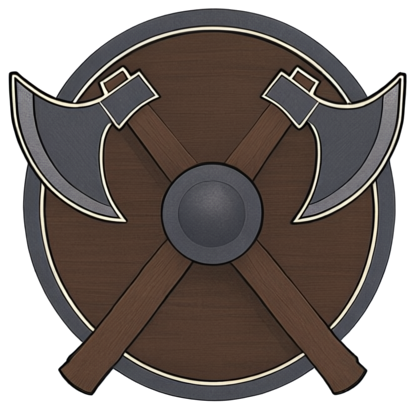
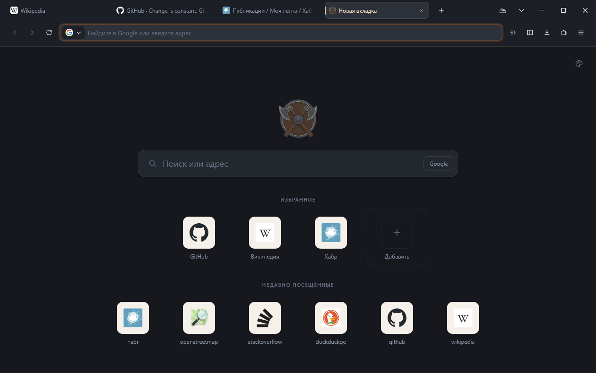
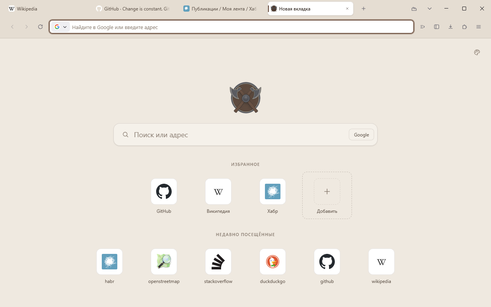
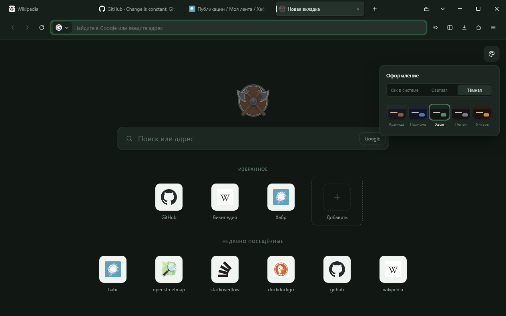

<div align="center">



# Vantara

**Браузер на движке Gecko, который защищает данные и не притворяется.**

**Русский** · [English](README.en.md)

[](https://github.com/L0lopop/Vantara/stargazers)
[](https://github.com/L0lopop/Vantara/network/members)
[](LICENSE)
[](docs/ARCHITECTURE.md)
[](docs/ROADMAP.md)

</div>

<p align="center">
  
</p>

---

## Что это

Vantara — форк Firefox с полностью переписанным интерфейсом и другим подходом
к приватности. Не тема поверх Firefox и не сборка с правленым `about:config`,
а отдельный браузер: свой интерфейс, свои функции, свои настройки по умолчанию.

**Три принципа, от которых не отступаем:**

1. **Ноль телеметрии.** Никакой статистики использования — ни анонимной,
   ни «для улучшения продукта».
2. **Честность о защите.** У каждой защиты есть цена, и мы её называем.
   Браузер не обещает того, чего не может, — см. [модель угроз](docs/PRIVACY.md).
3. **Работает без сервера.** Ни одна функция не требует аккаунта.

## Что уже умеет

Браузер собирается из исходников Firefox 156 в `vantara.exe` и полный
установщик — со своим именем, иконкой и идентификатором приложения.

**Приватность**

- Телеметрия, отчёты о сбоях и система удалённых экспериментов вырезаны
  при сборке — в готовом браузере их кода нет
- Не собираются фоновые службы Firefox: ежедневный агент с отчётом Mozilla
  и служба обновлений с правами SYSTEM
- Строгая защита от слежки на новом профиле, только HTTPS
- Поиск по умолчанию — Google, поисковые подсказки выключены
- Без аккаунта Mozilla, рекламы и рекомендаций Firefox
- Около 110 заводских настроек приватности, у каждой группы — объяснение,
  зачем она нужна

**Функции, которых нет в Firefox**

- **Журнал запросов** — куда страница отправляет данные, что заблокировано
  и какие трекеры защита пропустила. Живой, отдельный для каждой вкладки,
  хранится только в памяти
- **Щит** у адресной строки — отмечает каждую блокировку, ведёт общий
  счётчик без адресов и истории
- **Новая вкладка** без единого сетевого запроса: избранное и недавно
  посещённые сайты со значками из локальной истории

**Интерфейс**

- Свой набор иконок, вкладки, меню, панели и анимации
- Группы вкладок с анимацией слияния
- Пять палитр и светлая, тёмная или системная схема
- Русский и английский — по языку системы

В работе — [этап 1](docs/ROADMAP.md): служебные страницы, свой заголовок
окна, боковая панель. Дальше — первый релиз.

## Как выглядит

Снимки текущей сборки. Браузер в разработке, и интерфейс ещё будет меняться.

<table>
  <tr>
    <td width="50%"></td>
    <td width="50%"></td>
  </tr>
  <tr>
    <td align="center"><sub>Светлая схема</sub></td>
    <td align="center"><sub>Панель оформления: схема и пять палитр, здесь — «Хвоя»</sub></td>
  </tr>
</table>

**Группы вкладок.** Выделите вкладки щелчком с Ctrl и нажмите кнопку
с папкой на полосе вкладок — или перетащите одну вкладку на другую.
Вкладки слетаются к группе, ярлык группы появляется с отскоком.

<p align="center">
  
  <br><sub>Анимация замедлена в два раза</sub>
</p>

## Макет без сборки

Макет интерфейса — окно браузера, набор иконок и палитра с переключателем
тёмной и светлой темы. Ничего устанавливать не нужно:

```bash
python -m http.server 8777
```

затем открыть:

- `http://localhost:8777/docs/preview/index.html` — макет окна браузера
- `http://localhost:8777/ui/pages/newtab/index.html` — страница новой вкладки

## Собрать

Готовых релизов пока нет — браузер собирается из исходников под Windows.
Порядок, требования и все подводные камни — в [BUILD.md](docs/BUILD.md).
Собранный браузер запускается так — с постоянным профилем внутри папки
проекта:

```powershell
.\tools\start.ps1
```

Для работы над интерфейсом полная сборка не нужна: стили запускаются
поверх установленного Firefox в отдельном профиле, не затрагивая ваш.

```powershell
.\tools\dev-profile.ps1
```

## Документация

| Документ | О чём |
|---|---|
| [ARCHITECTURE.md](docs/ARCHITECTURE.md) | Почему форк Firefox, как устроен проект, слои интерфейса |
| [ROADMAP.md](docs/ROADMAP.md) | Этапы, что берём у других браузеров, чего не делаем |
| [PRIVACY.md](docs/PRIVACY.md) | Модель угроз, уровни защиты, открытые вопросы |
| [DESIGN.md](docs/DESIGN.md) | Палитра, форма, правила движения |
| [BUILD.md](docs/BUILD.md) | Прототип и полная сборка |

## Структура

```
brand/     логотипы, иконки приложения и трея
configs/   конфигурация сборки и брендинг
docs/      документация и макет интерфейса
ui/        интерфейс: стили, иконки, скрипты окна, новая вкладка, настройки
src/       изменения поверх исходников Firefox (патчи и новые файлы)
tools/     сборка, перенос интерфейса, проверки собранного браузера
```

## История звёзд

<a href="https://star-history.com/#L0lopop/Vantara&Date">
  <picture>
    <source media="(prefers-color-scheme: dark)"
            srcset="https://api.star-history.com/svg?repos=L0lopop/Vantara&type=Date&theme=dark">
    
  </picture>
</a>

## Лицензия

[MPL 2.0](LICENSE) — та же лицензия, что у Firefox, как того требует форк.

Vantara не связана с Mozilla Foundation. Товарные знаки Mozilla и Firefox
в сборке не используются.
